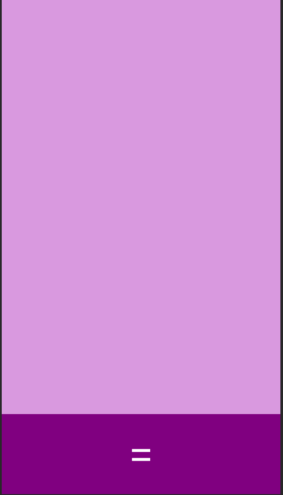
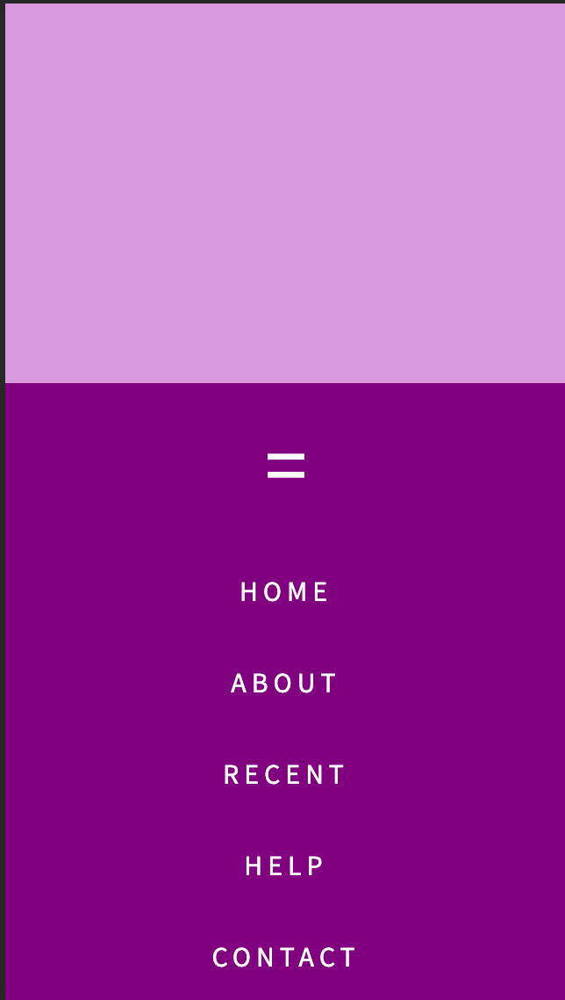

# bottom-navbar

A responsive bottom navbar implementation built with HTML and CSS using the input:checkbox method to toggle the menu open and closed. 

This is what the menu looks like when not toggled:

This is what the menu looks like when toggled:

